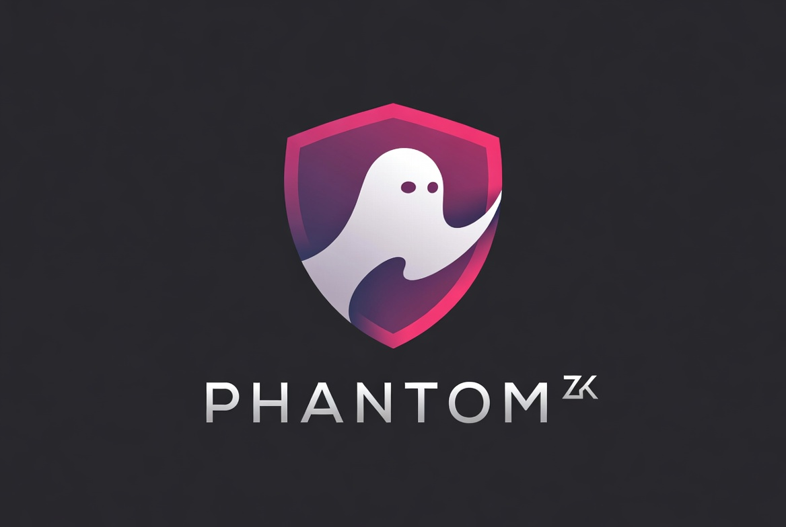

# PHANTOM — Private BTC Yield Manager on Starknet



**The first Private BTC Yield Manager on Starknet. Built on strkBTC and STRK20.**

---

## What PHANTOM Is Now

**Before March 10, 2026:** "A shield pool for BTC-backed assets on Starknet, waiting for Stwo"

**After March 10, 2026:** "The first Private BTC Yield Manager on Starknet, built on STRK20 and strkBTC"

PHANTOM now lets you earn yield on your Bitcoin while keeping your position, amount, and returns private. Powered by Starknet's native privacy layer.

---

## How It Works

### 1. Get strkBTC
Convert your wBTC, tBTC, LBTC, or SolvBTC to strkBTC. strkBTC is Starknet's native private Bitcoin token with optional shielding built-in.

### 2. Deposit into Yield Strategies
Choose from three strategies:
- **Vesu** — BTC lending (3.5% APY)
- **Ekubo** — BTC/USDC LP (8.2% APY)
- **Re7** — Managed BTC vault (6.2% APY)

### 3. Earn Privately
Your position, amount, and returns stay hidden on-chain. Only you can see your balance. Use viewing keys to prove your holdings to auditors when needed.

---

## Technology Stack

- **strkBTC** — BTC-backed asset with optional privacy
- **STRK20** — Starknet's native privacy standard for ERC-20 tokens
- **Starkzap SDK** — Integration layer for BTC staking and DeFi
- **Next.js 14** — Frontend framework
- **Starknet React** — Wallet connection (Argent X, Braavos)
- **Cairo** — Smart contracts

---

## Getting Started

### Installation

```bash
# Install dependencies
npm install

# Run development server
npm run dev
```

Visit http://localhost:3000 to use the app.

### Configuration

Copy `.env.example` to `.env.local` and configure:

```bash
# Starknet
NEXT_PUBLIC_STARKNET_NETWORK=sepolia
NEXT_PUBLIC_STARKNET_RPC_URL=https://starknet-sepolia.public.blastapi.io/rpc/v0_7

# strkBTC (TBD when launched)
NEXT_PUBLIC_STRKBTC_ADDRESS=

# PHANTOM Yield Router (deploy yield_router.cairo)
NEXT_PUBLIC_YIELD_ROUTER_ADDRESS=

# Strategy contracts
NEXT_PUBLIC_VESU_POOL_ADDRESS=
NEXT_PUBLIC_EKUBO_POOL_ADDRESS=
NEXT_PUBLIC_RE7_VAULT_ADDRESS=
```

---

## Project Structure

```
phantom/
├── app/                    # Next.js pages
│   ├── page.tsx            # Landing page
│   ├── yield/              # Yield strategy selector
│   ├── swap/               # Get strkBTC
│   ├── shield/             # Shielding info
│   ├── compliance/          # Viewing key generator
│   └── developers/         # API documentation
├── components/             # React components
│   └── layout/Nav.tsx      # Navigation
├── hooks/                  # Custom hooks
│   └── useStrkBTC.ts       # strkBTC balance hook
├── sdk/                    # SDK
│   ├── src/
│   │   ├── strategies/     # Yield strategies
│   │   ├── PositionManager.ts  # Position management
│   │   ├── PhantomSDK.ts   # Main SDK
│   │   └── key-derivation.ts  # Key management
│   └── package.json
├── contracts/              # Cairo contracts
│   └── yield_router/       # Yield router contract
└── circuits/               # ZK circuits (legacy, STRK20 handles now)
```

---

## Architecture

### Frontend
- **Framework:** Next.js 14 with App Router
- **Styling:** Tailwind CSS with amber/void design system
- **Wallet:** starknet-react (Argent X, Braavos)
- **Data:** Local storage + IndexedDB for positions

### SDK
- **PositionManager:** Opens/closes yield positions
- **NoteStore:** Local encrypted storage for positions
- **Key Derivation:** Generates viewing keys for compliance

### Contracts
- **YieldRouter:** Routes deposits to yield strategies, tracks positions

---

## Compliance

PHANTOM supports selective disclosure through viewing keys:

- **Full History** — Prove all transactions and amounts
- **Range Proof** — Prove amount is within a range without revealing exact
- **Existence Only** — Prove transactions exist without amounts

Generate a viewing key at `/compliance` and share with auditors or regulators.

---

## Development

```bash
# Build frontend
npm run build

# Build SDK
npm run sdk:build

# Test SDK
npm run sdk:test

# Deploy contracts (Sepolia)
./scripts/deploy_sepolia.sh
```

---

## Roadmap

- [x] Phase 1: Core yield functionality (Mar 2026)
- [x] Phase 2: Frontend completion (Mar 2026)
- [ ] Deploy YieldRouter to Sepolia
- [ ] Test position open/close flow
- [ ] Connect with Starknet Foundation

---

## Links

- **Website:** https://phantom.btc (coming soon)
- **Discord:** (coming soon)
- **Twitter:** @phantom_btc

---

*Built by @galmanus in Florianópolis, Brazil*
*March 2026*
